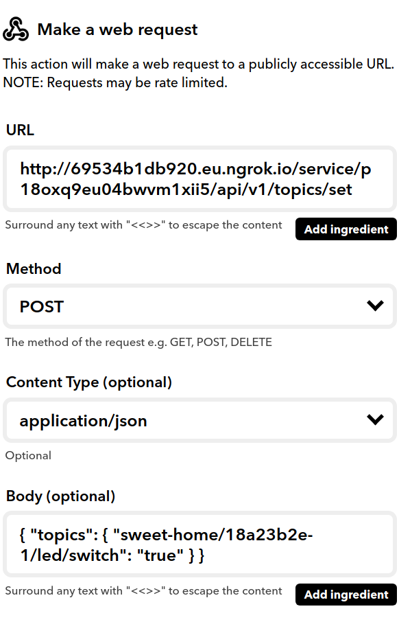

# REST adapter
<base-url>=http(s)://<2smart-ip>/service/<service-id>

## Topics

### Get topics
    GET <base-url>/api/v1/topics?to=<topic or topic object or array of either>
    
- `to` is topic
- `to` is topic objects with wildcards(`+`, `#`)
- `to` is array of topics and topic objects

##### Examples
    GET <base-url>/api/v1/topics?to=a/b/c
    GET <base-url>/api/v1/topics?to=a/+/c
    GET <base-url>/api/v1/topics?to=a/+/#
    GET <base-url>/api/v1/topics?to[]=a/b/c&to[]=a/+/c&to[]=a/+/#

##### Response

```JSON5
    {
        "status": 1,
        "data": {
          "topics": {
            "topic1":"<topic1-value>",
            "topic2":"<topic2-value>",
            // ...
          }
        }
    }

```
-----------


### Set topics
    POST <base-url>/api/v1/topics/set

##### Body
{
    topics:{
        "topic1":<primitive-value>,
        "topic2":<primitive-value>
    }
}
##### Response

```JSON5
    {
        "status": 1,
        "data": {
          "topics": {
            "topic1":"<topic1-value>",
            "topic2":"<topic2-value>",
            // ...
          },
          "topicErrors": {
            "topic1":{
              "code":"<ERROR_CODE>" 
            },
            // ...
          }
        }
    }
```
-----------


## Entities

### Get devices
    GET <base-url>/api/v1/devices?only_ids=<true|false>

- `only_ids=true` to return only device ids
- `only_ids=false` to return device objects

##### Response(only_ids=true)

```JSON5
    {
        "status": 1,
        "data": {
          "devices": [
            "<device1-id>",
            "<device2-id>",
            // ...
          ]
        }
    }
```

##### Response(only_ids=false)

```JSON5
    {
        "status": 1,
        "data": {
          "devices": [
            {/* device1 object */},
            {/* device2 object */},
            // ...
          ]
        }
    }
```
-----------


### Get device by id
    GET <base-url>/api/v1/device?deviceId=<device-id>

##### Response
```JSON5
    {
        "status": 1,
        "data": {
          "device": {
            /* device object */
          }
        }
    }
```
-----------

### Get node by id
    GET <base-url>/api/v1/node?deviceId=<device-id>&nodeId=<node-id>

##### Response
```JSON5
    {
        "status": 1,
        "data": {
          "node": {
            /* node object */
          }
        }
    }
```
-----------


### Get sensor by id
    GET <base-url>/api/v1/sensor?deviceId=<device-id>&nodeId=<node-id>&sensorId=<sensor-id>

##### Response
```JSON5
    {
        "status": 1,
        "data": {
          "sensor": {
            /* sensor object */
          }
        }
    }
```
-----------


### Get option by id(of device or node)
    GET <base-url>/api/v1/option?deviceId=<device-id>&optionId=<option-id>
    GET <base-url>/api/v1/option?deviceId=<device-id>&nodeId=<node-id>&optionId=<option-id>

##### Response
```JSON5
    {
        "status": 1,
        "data": {
          "option": {
            /* option object */
          }
        }
    }
```
-----------


### Get telemetry by id(of device or node)
    GET <base-url>/api/v1/telemetry?deviceId=<device-id>&telemetryId=<telemetry-id>
    GET <base-url>/api/v1/telemetry?deviceId=<device-id>&nodeId=<node-id>&telemetryId=<telemetry-id>

##### Response
```JSON5
    {
        "status": 1,
        "data": {
          "telemetry": {
            /* telemetry object */
          }
        }
    }
```
-----------

### Integration with IFTTT
You can simply integrate IFTTT(If This then That) with REST adapter. Choose any service as "This" service 
and "Webhooks" service as "That". You have to choose request method for Webhook(GET or POST), enter body 
and choose Content Type("application/json" for POST method). Now every "This" service event will trigger the webhook
and send the appropriative request to REST adapter.

**Important**: IFTTT "Webhooks" service does not allow setting request headers, so you must leave empty "Basic auth login" and "Basic auth password" fields while configure REST adapter
    
#### "Webhooks" service configuration example

